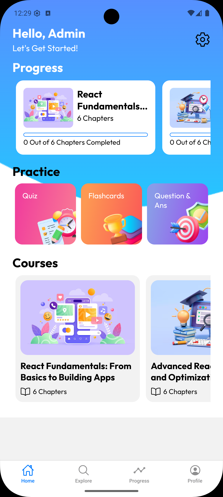

# CourseCraft — AI-Powered Course Generator



Self-Learning App is a modern **AI-powered mobile platform** built with **React Native** and **Firebase**.  
Users simply enter a topic they want to learn, and the app **automatically generates a structured course with chapters**, making learning more personalized and efficient.

## Features

- 🔮 **AI-generated courses & chapters** based on any topic
- 🔑 **Firebase Authentication**
- 📱 **Cross-platform mobile app** (iOS + Android)
- 🎨 Modern, responsive UI with **React Native**

## Installation

1. Clone the repository

   ```bash
   git clone https://github.com/AdhurimBerisha/CourseCraft.git
   ```

2. Install dependencies for frontend and backend
   npm install

3. Run the development servers

   ```bash
   npm start
   ```
